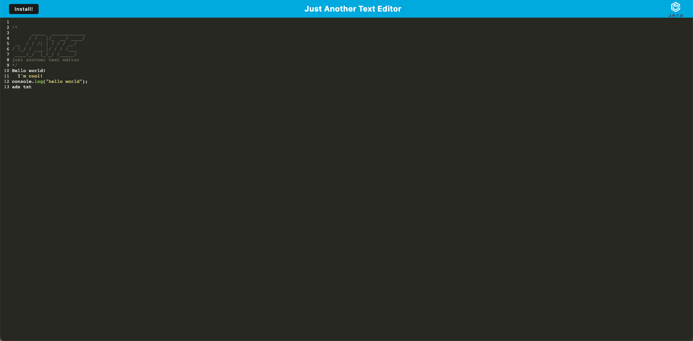

# Text Editor

## Description

PWA Text Editor (Jate "Just another text editor") is a simple Progressive Web Application text editor that runs in the browser. The single page application features a number of data persistence techniques that serve as redundancy in case one of the options is not supported by the browser. The application also functions offline.

## Badge


## Table of Contents

- [Installation](#installation)
- [Usage](#usage)
- [Screenshot](#screenshot)
- [Heroku Link](#heroku-link)
- [License](#license)
- [Contributing](#contributing)
- [Tests](#tests)
- [Questions](#questions)
- [Badges](#badges)
- [Sources](#sources)

## Installation

```
npm install
npm run build
npm start // or npm run start:dev
```

## Usage

You can use this application to take quick notes of both code and text. The notes are automatically saved when you move focus away from the editor. The application is a PWA and can be installed on your device. The application also works offline.

## Screenshot



## Heroku Link

[Link to working example](https://textedi.herokuapp.com/)

## License

[GPL](https://api.github.com/licenses/gpl-3.0)

## Contributing

To contribute, please fork the project and create a feature branch.

## Tests

This project has no test instructions

## Questions

Github Username: xclusive36  
Github Profile: [Github Profile](https://github.com/xclusive36/)  
Any additional questions, please reach out to me by email:  
Email: [Email](mailto:xclusive36@gmail.com)

## Sources

- [Express](https://expressjs.com/)  
  Fast, unopinionated, minimalist web framework for Node.js
  
- [IndexDB](https://developer.mozilla.org/en-US/docs/Web/API/IndexedDB_API)  
  IndexedDB is a low-level API for client-side storage of significant amounts of structured data, including files/blobs. This API uses indexes to enable high-performance searches of this data.

- [Service Workers](https://developer.mozilla.org/en-US/docs/Web/API/Service_Worker_API)
  Service workers essentially act as proxy servers that sit between web applications, and the browser and network (when available). They are intended to (amongst other things) enable the creation of effective offline experiences, intercepting network requests and taking appropriate action based on whether the network is available and updated assets reside on the server. They will also allow access to push notifications and background sync APIs.

- [Babel](https://babeljs.io/)  
  Babel is a JavaScript compiler. Use next generation JavaScript, today.

- [Webpack](https://webpack.js.org/)  
  Webpack is a static module bundler for modern JavaScript applications. When webpack processes your application, it internally builds a dependency graph which maps every module your project needs and generates one or more bundles.

- [Node.js](https://nodejs.org/en/)  
  Node.js® is a JavaScript runtime built on Chrome's V8 JavaScript engine.

- [NPM](https://www.npmjs.com/)
  npm is the package manager for JavaScript and the world’s largest software registry. Discover packages of reusable code — and assemble them in powerful new ways.

- [Nodemon](https://nodemon.io/)  
  Nodemon is a utility that will monitor for any changes in your source and automatically restart your server. Perfect for development.

- [Concurrently](https://www.npmjs.com/package/concurrently)  
  Run commands concurrently. Like npm run watch-js & npm run watch-less but better.

- [If-env](https://www.npmjs.com/package/if-env)  
  Use this to set environment variables in package.json scripts that use the Unix-style environment variables.

- [Heroku](https://www.heroku.com/)
  Heroku is a platform as a service (PaaS) that enables developers to build, run, and operate applications entirely in the cloud.

- [css-loader](https://www.npmjs.com/package/css-loader)  
  The css-loader interprets @import and url() like import/require() and will resolve them.

- and more...